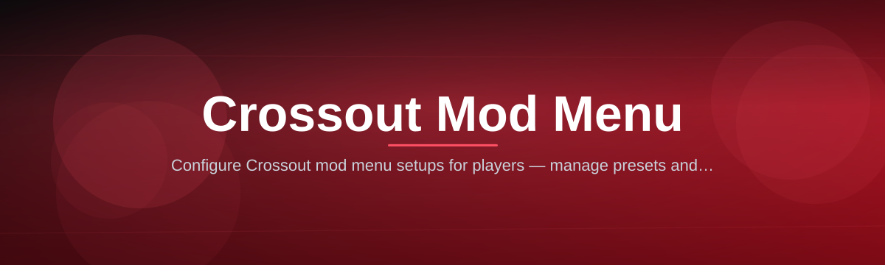

  
  
  

  

  
  
  

---

## 📦 Overview

Every Crossout raid comes down to one thing: whoever reacts first, wins. Stock clients leave you guessing — no radar, no fusion tracker, no clue what's behind that scrap wall. **Crossout Mod Menu 2026** closes that gap with a modular overlay that runs alongside the game client and gives you the information and loadout tools raiders have been asking for since the game left early access.

| Category | Details |
|---|---|
| Target Game | Crossout (Steam / Standalone client) |
| Build Type | Standalone `.exe`, no client-side file replacement |
| Update Cadence | Patched within 24–48h of major Crossout updates |
| Module Count | 39 active modules across 6 categories |
| Detection Track Record | Clean since v2.0 branch |
| Distribution | Direct landing page, no installer bundles |

The menu injects a lightweight overlay layer, reads memory it needs for HUD data, and exposes everything through a single hotkey-driven panel. No workshop uploads, no client file edits, no permanent changes to your Crossout install.

## ⬇️ Get the Build

  

---

## 🏁 Quick Start

1. 🖱️ Visit the project landing page and grab the latest packaged build.
2. 🗃️ Extract the archive to any writable folder — Desktop or a dedicated `Crossout Mods` folder both work fine.
3. 🎮 Launch Crossout first and load into the garage or a raid.
4. ▶️ Run the `.exe` as Administrator so the overlay can hook the render layer.
5. ⌨️ Press `Insert` in-game to open the menu panel and start toggling modules.

---

## 🧩 Known Issues

| Issue | Fix |
|---|---|
| Overlay doesn't appear on first launch | Alt-tab once after loading into a raid, the hook refreshes on focus change |
| Menu hotkey conflicts with chat bind | Rebind chat in Crossout settings or change the panel hotkey in the config tab |
| ESP boxes flicker on ultrawide monitors | Set the in-game resolution scale to 100% before enabling ESP modules |
| Fusion tracker shows stale data after a patch | Restart the `.exe`, module maps refresh automatically on relaunch |
| Menu closes when tabbing out mid-raid | Use windowed borderless mode instead of exclusive fullscreen |
| Skin preview module renders black textures | Disable in-game motion blur, it conflicts with the overlay's shader pass |

---

## 🚧 Troubleshooting Flow

Start here if something doesn't behave the way this page describes.

1. 🔍 Confirm Crossout is fully loaded (garage or raid) **before** launching the `.exe`.
2. 🔐 Right-click the `.exe` → Run as Administrator. Most hook failures trace back to permission scope.
3. 🧱 Temporarily disable third-party overlays (Discord, GeForce Experience) — overlay stacking is the #1 cause of render conflicts.
4. 🔁 If a module still won't toggle, close the menu, relaunch it, and check the Known Issues table above.
5. 🗒️ Still stuck? Note your Crossout patch version and menu build number before reaching out for support.

---

## 🛠️ Installation

1. **Download the archive.** Head to the project page and pull the current release package — always grab the newest version tag, older builds lag behind Crossout patches.
2. **Extract fully.** Unzip the entire folder structure before running anything; launching from inside a compressed archive is the most common cause of "missing module" errors.
3. **Whitelist the folder.** Add the extracted directory to your antivirus exclusions since heuristic scanners regularly flag overlay hooks as suspicious even when clean — then launch the `.exe` and confirm the panel opens with `Insert`.

---

## 🎯 The Problem

- Stock Crossout gives zero pre-engagement information — you find enemies by driving into their guns.
- Fusion and cabin health values are hidden until damage is already dealt, so trading blows is pure guesswork.
- Manually rebuilding a loadout after every balance patch wastes more time than actually raiding.
- Legendary skin previews inside the workshop are low-res and don't reflect in-raid lighting.
- Coin and badge farming for parts requires repetitive raid grinding with no visibility into per-match efficiency.
- Clan wars reward map awareness that the base HUD simply doesn't provide.
- Switching builds between PvP, PvE raids, and clan wars means re-equipping parts by hand every single time.

---

## 🧭 Tips for Best Results

- Enable only the modules you're actively using — stacking every overlay at once adds unnecessary render overhead.
- Recalibrate the ESP range slider after each Crossout map rotation; draw distances vary by biome.
- Save loadout presets before a balance patch drops so you can diff old vs new part stats instantly.
- Pair the fusion tracker with the cabin health overlay for the clearest trade-or-retreat read.
- Keep the menu's auto-update checker on — mismatched module builds are the top cause of overlay desync.
- Run a fresh raid test after any Crossout client update before trusting ESP positioning in a real match.

---

## ⚔️ Combat & Weapon Modules

Combat awareness is the backbone of this menu — these modules turn blind trades into calculated ones. Everything here reads live match data and overlays it directly on your screen without altering weapon behavior.

- **Weapon Cooldown Tracker** — live overlay of every equipped weapon's reload state.
- **Fusion Charge Readout** — shows enemy and ally fusion percentage in real time.
- **Cabin Health Estimator** — approximates remaining cabin HP based on visible damage.
- **Optimal Range Indicator** — highlights when your weapon class is inside effective range.
- **Melee Lock Warning** — flags incoming ramming vehicles before contact.
- **Ammo Type Overlay** — displays current ammo variant for dual-mode weapons.
- **Explosive Radius Preview** — draws blast radius rings for rocket and cannon classes.

## 🔩 Build & Loadout Tools

Rebuilding a Crossout build by hand after every patch is tedious — this category automates the repetitive parts. Presets sync with your current garage inventory so nothing you don't own gets suggested.

- **Loadout Preset Manager** — save and swap full builds in one click.
- **Part Stat Diff Viewer** — compares equipped parts against patch-note changes.
- **Weight Balance Calculator** — flags overweight builds before you queue.
- **Movement Part Optimizer** — suggests wheel/track swaps based on current map pool.
- **Structure Integrity Preview** — shows frame weak points from build layout.
- **Cargo Slot Planner** — organizes module and cabin slot combinations.
- **Auto-Repair Priority Setter** — orders repair kit targeting by part value.

## 🎨 Visual & Skins Customization

Crossout's skin and paint system is deep but clunky to preview. This category fixes the workshop's flat previews and gives you full control over how your rig looks in-raid.

- **High-Res Skin Previewer** — renders workshop skins in raid lighting conditions.
- **Paint Job Blender** — mixes two skin palettes into a custom livery.
- **Decal Placement Grid** — snaps decals to symmetric points on the chassis.
- **Cabin Glow Toggle** — enables/disables cabin light effects independently.
- **Weapon Skin Swapper** — previews weapon skins without equipping them permanently.
- **Garage Camera Freecam** — detaches the camera for build screenshots.

## 📡 ESP & Awareness Overlay

Map awareness wins raids before the first shot fires. This overlay category draws positional and threat data directly over the 3D world so you always know what's coming.

- **Enemy Vehicle ESP** — outlines hostile builds through terrain and scrap cover.
- **Distance & Bearing Tags** — labels every visible enemy with live range data.
- **Radar Ping Amplifier** — extends the base minimap's detection radius.
- **Threat Class Color-Coding** — colors ESP boxes by weapon archetype.
- **Clan War Objective Tracker** — highlights capture points and timers on-screen.
- **Convoy Escort Marker** — flags escort targets during PvE convoy raids.
- **Line-of-Sight Indicator** — shows whether an enemy currently has vision on you.

## 💰 Economy & Progression Utilities

Grinding coins and badges is unavoidable in Crossout, but tracking efficiency shouldn't be. These modules give you visibility into your farming rate so you know which raids are actually worth queuing.

- **Coin-Per-Raid Tracker** — logs earnings per match across sessions.
- **Badge Progress Overlay** — shows clan/faction badge progress live.
- **Part Drop Logger** — records rare part drops for inventory tracking.
- **Battle Pass Milestone Alert** — pings when a season tier is about to unlock.
- **Workshop Price Watcher** — flags underpriced parts on the exchange.
- **Session Efficiency Report** — end-of-session summary of coins/hour.

## 🧰 Client & Safety Utilities

Keeping the menu itself stable and low-profile matters as much as the features inside it. This category handles updates, config safety, and general client hygiene.

- **Auto-Update Checker** — verifies module builds match the latest Crossout patch.
- **Config Backup & Restore** — one-click save/restore of all menu settings.
- **Hotkey Remap Panel** — full rebind support for every menu shortcut.
- **Overlay Performance Mode** — trims render cost on lower-end GPUs.
- **Session Log Exporter** — exports raid session data for personal review.
- **Safe-Exit Cleanup** — fully unhooks the overlay on menu close.

---

## 🗂️ Table of Contents

- [📦 Overview](#-overview)
- [⬇️ Get the Build](#️-get-the-build)
- [🏁 Quick Start](#-quick-start)
- [🧩 Known Issues](#-known-issues)
- [🚧 Troubleshooting Flow](#-troubleshooting-flow)
- [🛠️ Installation](#️-installation)
- [🎯 The Problem](#-the-problem)
- [🧭 Tips for Best Results](#-tips-for-best-results)
- [⚔️ Combat & Weapon Modules](#️-combat--weapon-modules)
- [🔩 Build & Loadout Tools](#-build--loadout-tools)
- [🎨 Visual & Skins Customization](#-visual--skins-customization)
- [📡 ESP & Awareness Overlay](#-esp--awareness-overlay)
- [💰 Economy & Progression Utilities](#-economy--progression-utilities)
- [🧰 Client & Safety Utilities](#-client--safety-utilities)
- [📖 What is Crossout Mod Menu](#-what-is-crossout-mod-menu)
- [📋 Usage Guidelines](#-usage-guidelines)
- [🗯️ FAQ](#️-faq)
- [🧠 The Solution](#-the-solution)
- [🌟 Key Features](#-key-features)
- [🖥️ System Requirements](#️-system-requirements)
- [🧷 Final Download](#-final-download)

---

## 📖 What is Crossout Mod Menu

| Term | Explanation |
|---|---|
| Overlay Hook | The render-layer attachment that draws ESP, HUD, and menu elements over Crossout |
| Module | A single feature toggle inside the menu — 39 total, grouped into 6 categories |
| Fusion Tracker | Module that reads fusion charge percentage for allies and enemies |
| Loadout Preset | A saved build configuration that can be reapplied in one click |
| Panel Hotkey | The keybind (`Insert` by default) that opens/closes the menu UI |
| Safe-Exit | The unhook process that removes all overlay traces when the menu closes |
| Session Log | A local record of raid performance data used by economy modules |

**Why it matters:**

- Consolidates ESP, loadout, and economy tools into a single panel instead of juggling separate tools.
- Runs as a standalone overlay — your Crossout install files stay untouched.
- Modules refresh automatically after Crossout patches, so mapped memory offsets don't go stale.
- Config presets carry over between sessions, so setup only happens once.

---

## 📋 Usage Guidelines

| Allowed | Not Allowed |
|---|---|
| Running the menu in PvE raids and private test matches | Advertising module capabilities inside public in-game chat |
| Using loadout presets for personal build management | Redistributing the packaged `.exe` under a different name |
| Sharing skin preview screenshots taken via the menu | Reverse-engineering the overlay hook for a separate product |
| Reporting bugs or patch-desync issues | Using the menu to harass players in ranked clan wars |
| Adjusting hotkeys and performance settings freely | Bundling the `.exe` with unrelated third-party installers |

---

## 🗯️ FAQ

**Q: Does this modify any Crossout game files?**
A: No. The overlay reads data and renders on top of the client — nothing in your Crossout install directory is edited.

**Q: Do I need to relaunch the `.exe` after every Crossout patch?**
A: Yes, module maps are patch-specific. The Auto-Update Checker will flag when a refresh is needed.

**Q: Can I use this in clan wars?**
A: The menu runs in any Crossout mode, but check your clan's internal rules before using ESP in competitive wars.

**Q: Why does the panel not open when I press Insert?**
A: Confirm the `.exe` is running as Administrator and Crossout is already loaded into a garage or raid.

**Q: Will loadout presets survive a Crossout part rebalance?**
A: Presets store part IDs, not stats, so they reapply correctly — the Part Stat Diff Viewer will flag any changed values.

**Q: Does the overlay affect FPS?**
A: Minimal impact with Overlay Performance Mode enabled; ESP-heavy configurations on older GPUs may see a small dip.

**Q: Is there a mobile or console version?**
A: No, this build targets the Windows PC Crossout client only.

---

## 🧠 The Solution

|

  

